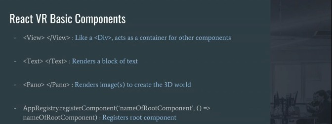
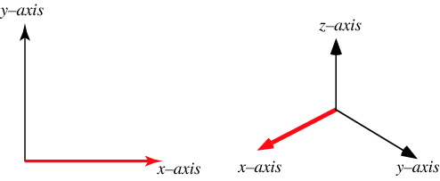
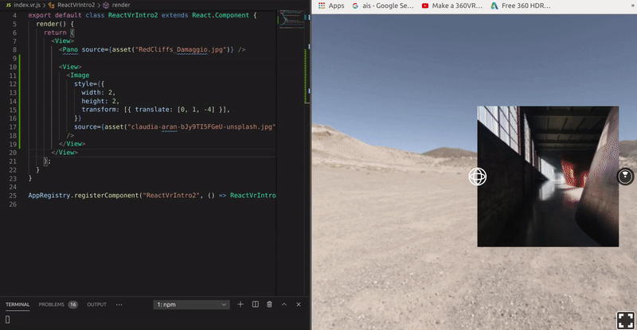
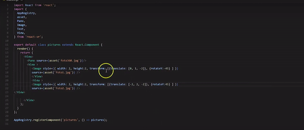

# React 360 _VR IMAGES_

## Learning how to add and manipulate images

[](https://www.youtube.com/watch?v=PnYhS4Ygs3s&list=LL&index=5)

<br>
<br>

<!-- > the best 360 cameras

[Ricoh Theta Z1: The DSLR of 360 Cameras?](https://www.youtube.com/watch?v=0uN7k9VSu_8)

[The Best 360 Cameras for 2021 | PCMag](https://uk.pcmag.com/digital-camcorders/89938/the-best-360-cameras-for-2020) -->

<br>

# START 🐖

- START by adding images inside the static_assets folder 🌻

###### You can find 360 panorama here:

[Unsplash (FREE)](https://unsplash.com/s/photos/360)

[123RF (PAID)](https://www.123rf.com/photo_113527037_spherical-360-panorama-projection-interior-empty-room-3-d-rendering.html)

- add 360 deg images to the panorama

```javascript
// <Pano> stands for "panorama"

<Pano source={asset("chess-world.jpg")} />
// chess-world is the default image
//
//
```

<br>

##### NEW IMAGE (result)

- After hours of searching, I finally found something clean and free

- Click on the image to visit the artist shop (nice 3D models)

[](https://www.turbosquid.com/Search/Index.cfm?keyword=damaggio)

<br>

##### Before adding the additional images to the scene | DELETE the following:

```javascript
<Text
  style={{
    backgroundColor: "#777879",
    fontSize: 0.8,
    fontWeight: "400",
    layoutOrigin: [0.5, 0.5],
    paddingLeft: 0.2,
    paddingRight: 0.2,
    textAlign: "center",
    textAlignVertical: "center",
    transform: [{ translate: [0, 0, -3] }],
  }}
>
  hello
</Text>
```

<br>

##### Download or create in (photoshop) few images with the following measurements:

- Picture 1: 800 x 600
- Picture 2: 400 x 300
- Picture 3: 800 x 600

- OR YOU CAN JUST DO LIKE ME and set up random images just to see what it makes

### REMEMBER 🌞

- You need to import "image" like so, to add additional images:

```javascript
// index.vr.js
//  INCLUDE: image here:
import { AppRegistry, asset, Pano, Image, View } from "react-vr";
```

<br>

#### SET UP "height:" and "width:" 🐖

```javascript
<View>
  <Image
    style={{
      width: 1,
      height: 1,
      //   CAREFUL!! here you use Meters instead of Pixels
    }}
  />
</View>
```

#### SET UP "the axis"

```javascript
transform: [{ translate: [0, 1, -5] }]; //-5 is the Z-axis "- is back/forward"
```

- Z, AXIS

[](https://www.turbosquid.com/Search/Index.cfm?keyword=damaggio)

<br>

[](https://www.turbosquid.com/Search/Index.cfm?keyword=damaggio)

<br>

### result

```javascript
return (
  <View>
    <Pano source={asset("RedCliffs_Damaggio.jpg")} />

    <View>
      <Image
        style={{
          width: 2,
          height: 2,
          transform: [{ translate: [-10, 10, -10] }],
        }}
        source={asset("claudia-aran-bJy9TI5FGeU-unsplash.jpg")}
      />
    </View>
  </View>
);
```

#### NOW ADD A SECOND IMAGE (duplicate the first procedure)

```javascript
return (
  <View>
    <Pano source={asset("RedCliffs_Damaggio.jpg")} />

      <View>
        <Pano source={asset("RedCliffs_Damaggio.jpg")} />

        <View>
          <Image
            style={{
              width: 2,
              height: 2,
              transform: [{ translate: [0, 1, -4] }],
            }}
            source={asset("andriyko-podilnyk-kOcPPFamcag-unsplash.jpg")}
          />
        </View>
        <View>
          <Image
            style={{
              width: 2,
              height: 2,
              transform: [{ translate: [2, 2, -5] }],
            }}
            source={asset("coco-tafoya-2Z7GgUpsSqg-unsplash.jpg")}
          />
        </View>
      </View>
);
```

<br>

[]()

###### If you play a bit with the second image, you will notice that since the images aren't wrapped in a container, the second image take reference from the FIRST ONE

<br>

### THE NEXT STEP 🐖

- THE NEXT STEP is going to be a bit more complicated, because since its a spheric space, we must to know how to situate the images

#### ROTATE { rotateY: 60 }]

```javascript
[{ translate: [0, 1, -10] }, { rotateY: 60 }]; //-60 to the opposite image
```

<br>

```javascript
  <View>
          <Image
            style={{
              width: 1,
              height: 1,
              transform: [{ translate: [0, 1, -2] }, { rotateY: -60 }],
            }}
            source={asset("claudia-aran-bJy9TI5FGeU-unsplash.jpg")}
          />
        </View>
        <View>
          <Image
            style={{
              width: 1,
              height: 1,
              transform: [{ translate: [-2, 2, -2] }, { rotateY: 60 }],
            }}
            source={asset("clay-banks-k2jF0dYhEKc-unsplash.jpg")}
          />
        </View>
      </View>
```

<br>

#### RESULT (rotateY and rotateX )

- If you rotate a little bit too much the images, they will be blurred.

[]()

<br>
<br>
<br>

### TO BALANCE THE IMAGES 🐖

- calculate the following:

> IF the width and the height is 2, to this 2 you have to + 1, the result is 3 and this 3 will go to the second image

[]()

```javascript
return (
  <View>
    <Pano source={asset("RedCliffs_Damaggio.jpg")} />

    <View>
      <Image
        style={{
          width: 2,
          height: 2,
          transform: [{ translate: [0, 1, -2] }, { rotateY: -45 }],
        }}
        source={asset("andriyko-podilnyk-kOcPPFamcag-unsplash.jpg")}
      />
    </View>
    <View>
      <Image
        style={{
          width: 2,
          height: 2,
          transform: [{ translate: [-2, 3, -2] }, { rotateY: 45 }],
        }}
        source={asset("coco-tafoya-2Z7GgUpsSqg-unsplash.jpg")}
      />
    </View>
  </View>
);
```

[]()
